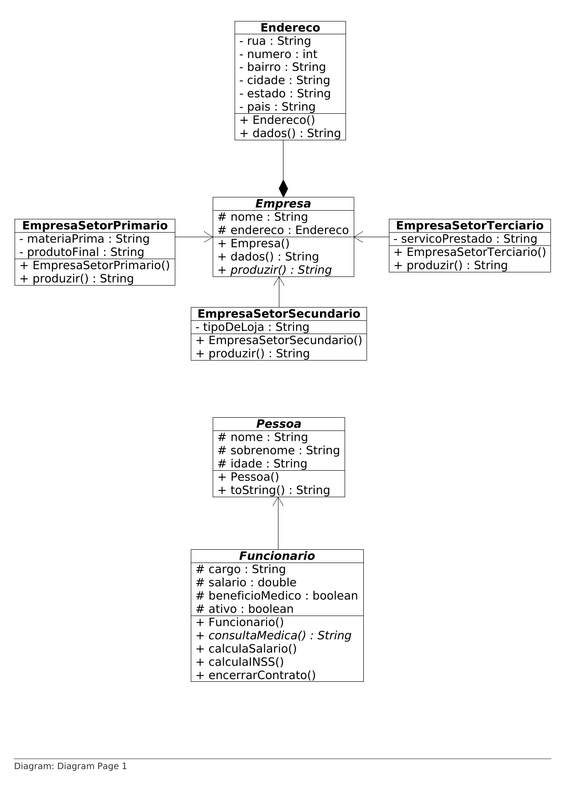

# Gerenciador De Empresa

Projeto da faculdade para criar uma aplicação onde devem estar presentes
as características básicas do paradigma POO (Programação Orientada a Objetos).

Veja o repositório clicando [aqui](https://github.com/RodgerOliver/gerenciador-de-empresa).

## Diagrama UML

